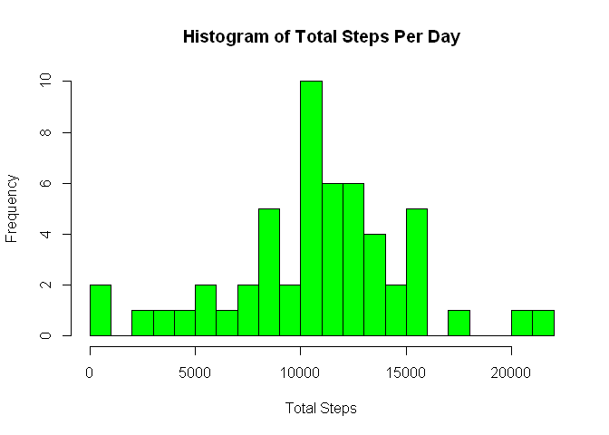
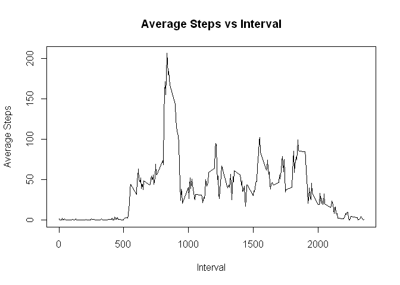
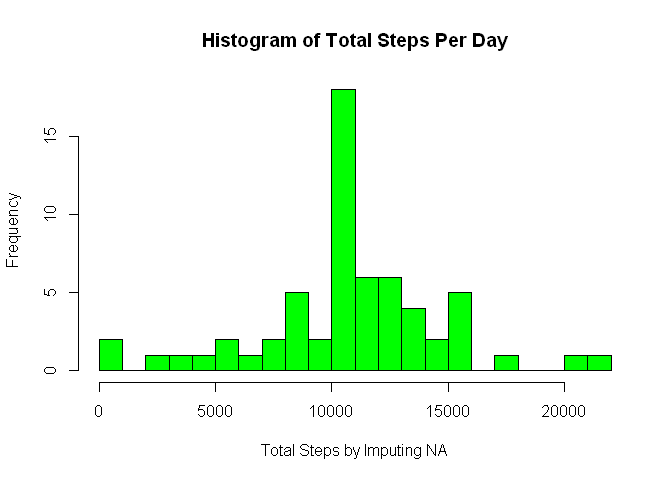
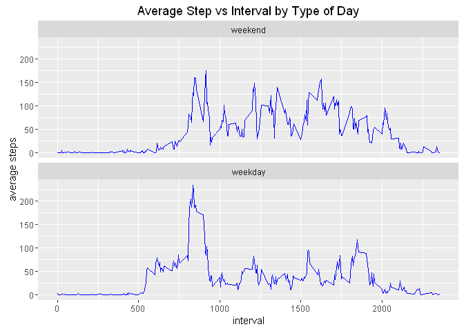

# Reproducible Research: Peer Assessment 1


## Loading and preprocessing the data

```r
#load ggplot2
library(ggplot2)

#1. Load the data (i.e. read.csv())
d<-read.csv("activity.csv")

#2. Process/transform the data (if necessary) into a format suitable for your analysis
```

## What is mean total number of steps taken per day?

```r
#1. Make a histogram of the total number of steps taken each day
#get dataset for total number of step per day
StepTotalByDate<-aggregate(steps~date,d,sum)

#plot histogram
hist(StepTotalByDate$steps,col="green",breaks = 20,xlab="Total Steps", main="Histogram of Total Steps Per Day")
```

<!-- -->

```r
#2. Calculate and report the mean and median total number of steps taken per day
#calculate mean
MeanTotal<-mean(StepTotalByDate[,2])
print(MeanTotal)
```

```
## [1] 10766.19
```

```r
#calculate median
MedianTotal<-median(StepTotalByDate[,2])
print(MedianTotal)
```

```
## [1] 10765
```


## What is the average daily activity pattern?

```r
#1. Make a time series plot (i.e. type = "l") of the 5-minute interval (x-axis) and the average number of steps taken, averaged across all days (y-axis)

#get dataset for average number of step per 5min interval
StepAvgByInterval<-aggregate(steps~interval,d,mean)

#plot
with(StepAvgByInterval,plot(interval, steps,type="l", xlab="Interval",ylab="Average Steps", main="Average Steps vs Interval"))
```

<!-- -->

```r
#2. Which 5-minute interval, on average across all the days in the dataset, contains the maximum number of steps?
#sort dataset by steps descending and print out the first one
Sorted<-StepAvgByInterval[order(-StepAvgByInterval$steps),]
head(Sorted,1)
```

```
##     interval    steps
## 104      835 206.1698
```

## Imputing missing values

```r
#1. Calculate and report the total number of missing values in the dataset (i.e. the total number of rows with NAs)
length(d$steps[is.na(d$steps)])
```

```
## [1] 2304
```

```r
#2. Devise a strategy for filling in all of the missing values in the dataset. The strategy does not need to be sophisticated. For example, you could use the mean/median for that day, or the mean for that 5-minute interval, etc.

#replace NA with mean of the interval 

#3. Create a new dataset that is equal to the original dataset but with the missing data filled in.
#join dataset with interval average dataset
ds<-merge(d,StepAvgByInterval, by="interval",all.x = TRUE)

#fill NA with interval average value
ds$steps.x[is.na(ds$steps.x)] <- ds$steps.y[is.na(ds$steps.x)]

#4. Make a histogram of the total number of steps taken each day and Calculate and report the mean and median total number of steps taken per day. Do these values differ from the estimates from the first part of the assignment? What is the impact of imputing missing data on the estimates of the total daily number of steps?
StepTotalByDate_ds<-aggregate(steps.x~date,ds,sum)

#plot histogram
hist(StepTotalByDate_ds$steps.x,col="green",breaks = 20,xlab="Total Steps by Imputing NA", main="Histogram of Total Steps Per Day")
```

<!-- -->

```r
#calculate mean
MeanTotal<-mean(StepTotalByDate_ds[,2])
print(MeanTotal)
```

```
## [1] 10766.19
```

```r
#calculate median
MedianTotal<-median(StepTotalByDate_ds[,2])
print(MedianTotal)
```

```
## [1] 10766.19
```

## Are there differences in activity patterns between weekdays and weekends?

```r
#1. Create a new factor variable in the dataset with two levels -- "weekday" and "weekend" indicating whether a given date is a weekday or weekend day.
#add new variable in dataset as weekdays
d$day<-weekdays(as.Date(d$date))
#update to weekday and weekend
d$day[d$day %in% c('Monday','Tuesday','Wednesday','Thursday','Friday')]<-"weekday"
d$day[d$day %in% c('Saturday','Sunday')]<-"weekend"

#2. Make a panel plot containing a time series plot (i.e. type = "l") of the 5-minute interval (x-axis) and the average number of steps taken, averaged across all weekday days or weekend days (y-axis). The plot should look something like the following, which was created using simulated data:
plot_data<-aggregate(steps ~ interval + day, data = d, mean)

#plot panel
plot_data$day <- factor(plot_data$day, levels = c("weekend", "weekday"))

g <- ggplot(plot_data, aes(interval, steps)) + geom_line(color="blue")
g + facet_wrap(~ day, ncol = 1) + labs(title = "Average Step vs Interval by Type of Day",x="interval", y="average steps")
```

<!-- -->
